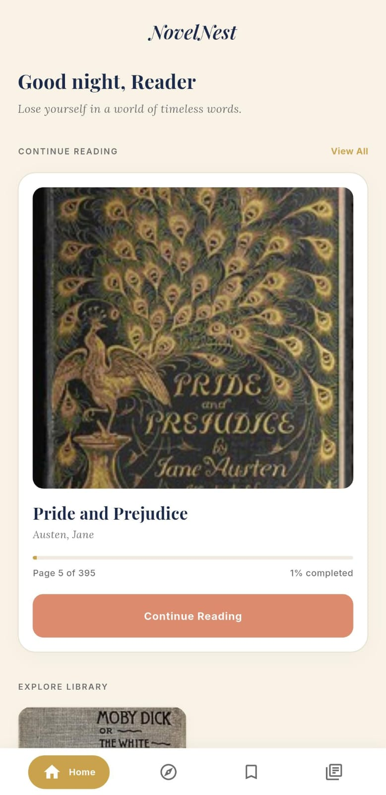
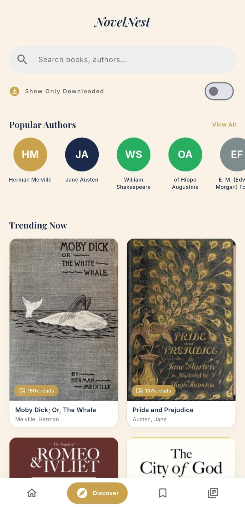
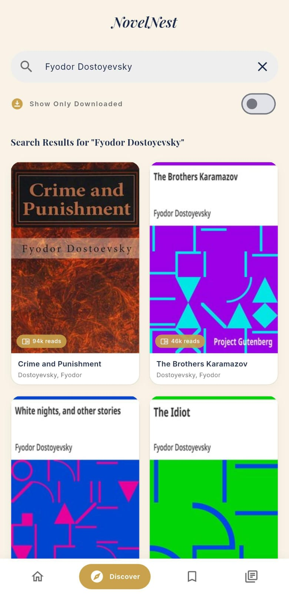
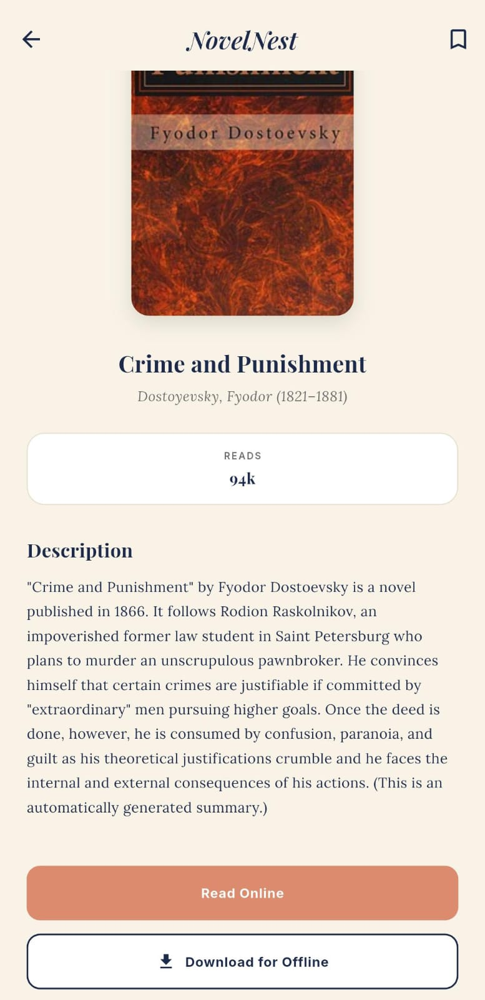
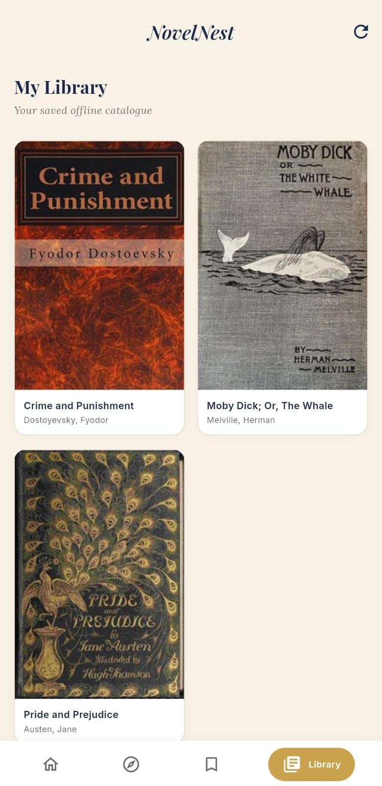
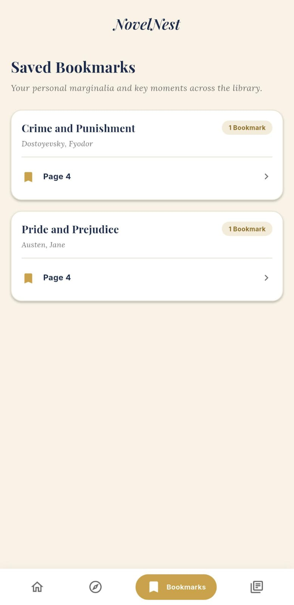
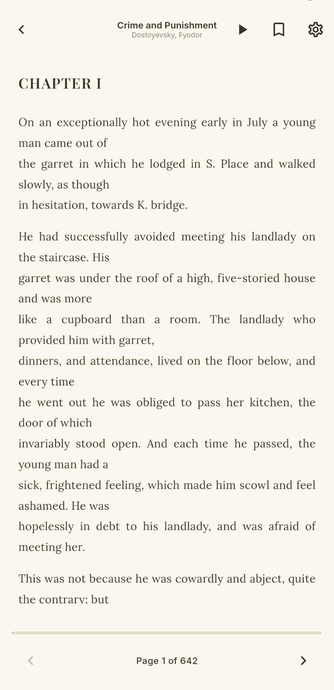
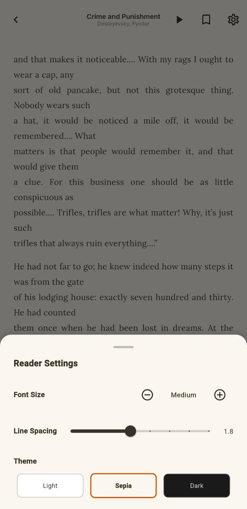
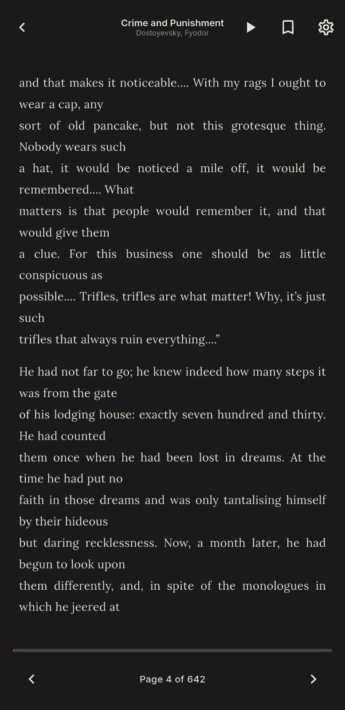
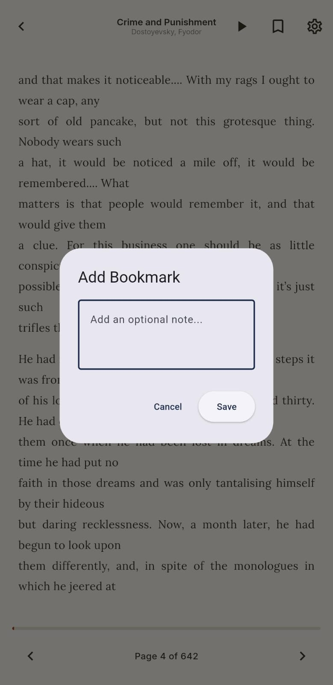

# 📚 NovelNest

A free, offline-capable digital library and e-book reader app built with Flutter. NovelNest lets you discover, read, and collect free public-domain classic novels — think Pride and Prejudice, Sherlock Holmes, Dracula, and Frankenstein — all in one clean, distraction-free reading space.

No login. No subscriptions. No ads. Just books.

---

## ✨ Features

- **Discover & Search** — Browse thousands of free classic novels sourced from Project Gutenberg via the Gutendex API. Search by title or author, with recent searches saved locally.
- **Read Online or Offline** — Start reading instantly online, or download a book for offline access anytime.
- **Personal Library** — Keep track of every book you've added, with real-time reading progress synced across the app.
- **Bookmarks** — Save your favorite moments and passages with optional personal notes, and jump straight back to them.
- **Custom Reader Experience** — A warm, paginated reading view with adjustable font size, line spacing, and light/sepia/dark themes — designed to feel like a real book, not a webpage.
- **Text-to-Speech** — Let NovelNest read chapters aloud, hands-free.
- **Jump to Page** — Instantly navigate to any page in a book instead of endless swiping.
- **Fully Offline Database** — All library data, progress, and bookmarks are stored locally using sqflite — no cloud account required.

---

## 📱 Screenshots

| Dashboard | Discover | Search Results |
|---|---|---|
|  |  |  |

| Novel Detail | My Library | Bookmarks |
|---|---|---|
|  |  |  |

| Reading Screen | Reader Settings | Dark Mode |
|---|---|---|
|  |  |  |

| Add Bookmark |
|---|
|      |  

---

## 🛠 Tech Stack

- **Framework:** Flutter (Windows Desktop / cross-platform)
- **Local Database:** sqflite
- **Networking:** http
- **Text-to-Speech:** flutter_tts
- **Fonts:** google_fonts (Playfair Display, Lora, Inter)
- **Charts (Dashboard stats):** fl_chart
- **State Management:** Provider

## 🌐 Data Source

NovelNest uses the [Gutendex API](https://gutendex.com) — a free, public, no-key-required REST API that indexes Project Gutenberg's entire catalog of 70,000+ public-domain books. All content is legally free to use, copy, and redistribute.

---

## 📂 Project Structure

```
lib/
├── main.dart
├── models/
│   ├── book_model.dart
│   ├── reading_progress_model.dart
│   └── bookmark_model.dart
├── db/
│   └── db_helper.dart
├── services/
│   ├── gutendex_service.dart
│   └── download_service.dart
├── screens/
│   ├── dashboard_screen.dart
│   ├── discover_screen.dart
│   ├── book_detail_screen.dart
│   ├── reader_screen.dart
│   ├── bookmarks_screen.dart
│   └── library_screen.dart
├── theme/
│   └── app_theme.dart
└── widgets/
    └── reader_settings_menu.dart
```

---

## 🚀 Getting Started

### Prerequisites
- Flutter SDK (3.x or later)
- Dart SDK
- An IDE (VS Code / Android Studio) or Windows desktop build support enabled

### Installation

```bash
git clone https://github.com/<your-username>/novelnest.git
cd novelnest
flutter pub get
flutter run
```

To build a Windows desktop release:

```bash
flutter build windows
```

---

## 🗄 Database Schema

NovelNest stores everything locally using sqflite across three tables:

- **books** — cached metadata for every book added to the library (title, author, cover, content URL, download status, local file path)
- **reading_progress** — last page read, total pages, and completion percentage per book
- **bookmarks** — saved pages with optional notes, linked to their book

---

**Laiba Usman** [https://github.com/Laiba-Usman]
